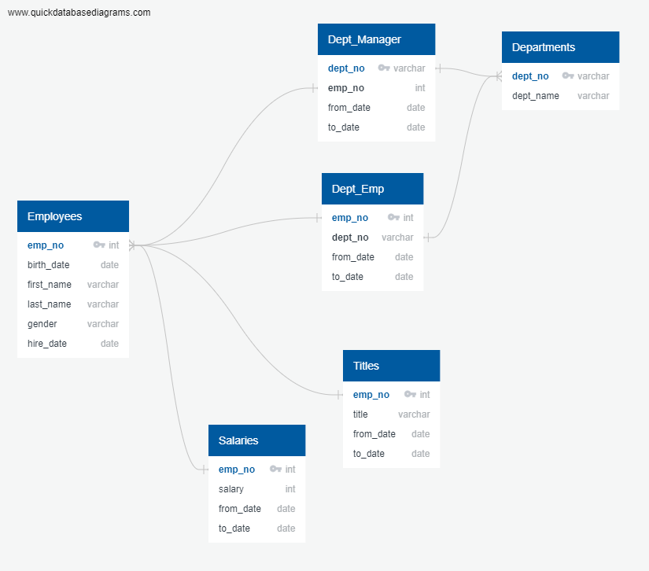
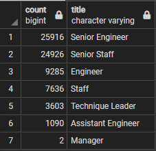
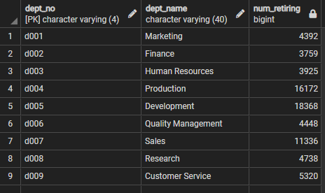
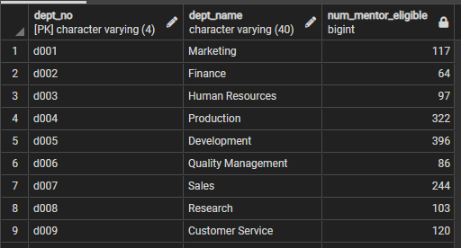

# pewlett-hackard-analysis
Data Analysis Bootcamp - Week 7

## Overview

The purpose of this project was to analyze HR data at a large company, Pewlett Hackard, to get a feel for how many employees they have on the verge of retirement in coming years. For the challenge we had two deliverables to create:
> - The number of retiring employees by title.
>   - Table of people retiring and all their titles: [retirement_titles.csv](Data/retirement_titles.csv)
>   - Table of people retiring and their current titles: [unique_titles.csv](Data/unique_titles.csv)
>   - Table of the number of people retiring, grouped by title: [retiring_titles.csv](Data/retiring_titles.csv)
> - A list of employees eligible for a new mentorship program: [mentorship_eligibility.csv](Data/mentorship_eligibility.csv)

## Resources

- Data Sources: 
    - [departments.csv](Data/departments.csv)
    - [dept_emp.csv](Data/dept_emp.csv)
    - [dept_manager.csv](Data/dept_manager.csv)
    - [employees.csv](Data/employees.csv)
    - [salaries.csv](Data/salaries.csv)
    - [titles.csv](Data/titles.csv)
- Software: pgAdmin 4, PostgreSQL 13.7

## Analysis

We were delivered the six csvs listed above in Data Sources. To begin with, we created a database in PostgreSQL, using pdAdmin 4 and the ERD shown below as a go-by. Once we had the database built we were ready to start running queries to answer the challenge questions above.

## Results

### Provide a bulleted list with four major points from the two analysis deliverables:
- The two most popular roles for retiring people, by far, are Senior Engineers and Senior Staff.
- Two of the departments have managers in line for retirement.

    

- There are 1,549 people in the mentorship_eligibility table. Which, compared to the 72,458 in the retire_by_title_unique table, means that those 1,500 people better be ready to pick up some major slack after they're mentored.
- There needs to be a major push in the next five years to find young replacements all around the company, unless the company is interested in shrinking as these baby boomers leave. That could look like sending recruiters to job fairs for college graduates, searching linkedin for people doing the work you want at other companies, pushing out advertisements on sites you think prospective candidates would browse, or any number of other ideas. No matter what it looks like, it needs to happen.

## Summary

### How many roles will need to be filled as the "silver tsunami" begins to make an impact?

There are 72,458 people eligible for retirement, shown by running a count query on the numbers of employees retiring by title table.

### Are there enough qualified, retirement-ready employees in the departments to mentor the next generation of Pewlett Hackard employees?

The number of people eligible for retirement, grouped by department, is shown below:

The number of people eligible for mentorship, grouped by department, is shown below:

Looking at those two tables it appears that, yes, in every case there are many more people eligible for retirement than there are eligible for mentoring. Even if you want to assign multiple mentors to each mentee, or a decent percentage of people retiring aren't interested in taking on a role as mentor, there should be enough to go around in every case.

### Two additional queries or tables that may provide more insight into the upcoming "silver tsunami."

One thing I noticed in the number of people retiring by title table is that two managers are leaving. The natural next question is, which departments have managers eligible for retirement? The query below identifies them as the managers of Sales and Research.

    SELECT
        rt.emp_no,
        rt.first_name,
        rt.last_name,
        rt.title,
        d.dept_name
    FROM retire_by_title_unique as rt
    INNER JOIN dept_emp AS de ON (rt.emp_no = de.emp_no)
    INNER JOIN departments AS d ON (de.dept_no = d.dept_no)
    WHERE title = 'Manager';

We built a list of people retiring, grouped by title. It could be useful to have the same table, but for the number of people eligible for mentorship. The query below accomplishes that.

    SELECT COUNT(title), title
    FROM mentorship_eligibility
    GROUP BY title
    ORDER BY 1 DESC;